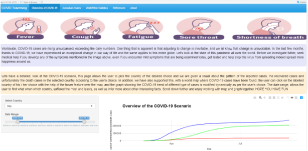

<!-- README.md is generated from README.Rmd. Please edit that file -->

```{r, include = FALSE}
knitr::opts_chunk$set(
  collapse = TRUE,
  comment = "#>",
  fig.path = "man/figures/README-",
  out.width = "100%"
)
```

# prikage

<!-- badges: start -->
[](https://github.com/etc5523-2020/r-package-assessment-priya51096/actions)
<!-- badges: end -->

```{r, fig.align='center', fig.cap="Logo of prikage", out.width="25%", echo=FALSE}

```


The goal of prikage is  it embeds my shiny application & launches its via a function called launch_app()

This package prikage, is my first ever R package this packages allows the to launch my first ever shiny application through the launch_app function exported by my package, prikage. 

The required shiny application has already been embedded my package.This package, gives the user and overview of COVID-19, by the exciting graphs embedded in this application and added user interactivity. 

Download this package and know more about its detailed functionality.

**HOPE YOU HAVE FUN**

## Installation

You can get the development version from [GitHub](https://github.com/) with:

``` r
# install.packages("devtools")
devtools::install_github("etc5523-2020/r-package-assessment-priya51096")
```
## Website Link to Package - Prikage

This link provided below, for the prikage package has obtained from _pkgdown package_

[prikage, Click Here](https://etc5523-2020.github.io/r-package-assessment-priya51096/)

## Example

This is a basic example which shows you how to solve a common problem:

```{r example, eval = FALSE, echo=TRUE}
library(prikage)
launch_app() 
```

## Output

On running the package it should take you to the landing page of my app. 

The image below helps you what is the expected output when you run the launch app function. *Have Fun, Play around the app*

```{r, fig.align='center', fig.cap="The Landing Page of my Shiny App", echo=FALSE}

```

## Feedback

Hey Reader,

Many Thanks for your interest in my R package

If you have enjoyed using this package, let me know, feel free to drop out at [Twitter](https://twitter.com/DingorkarPriya) or [Linkedin](https://www.linkedin.com/in/priya-dingorkar/)

If you have any suggestion, please a drop a message at the above mentioned link.
